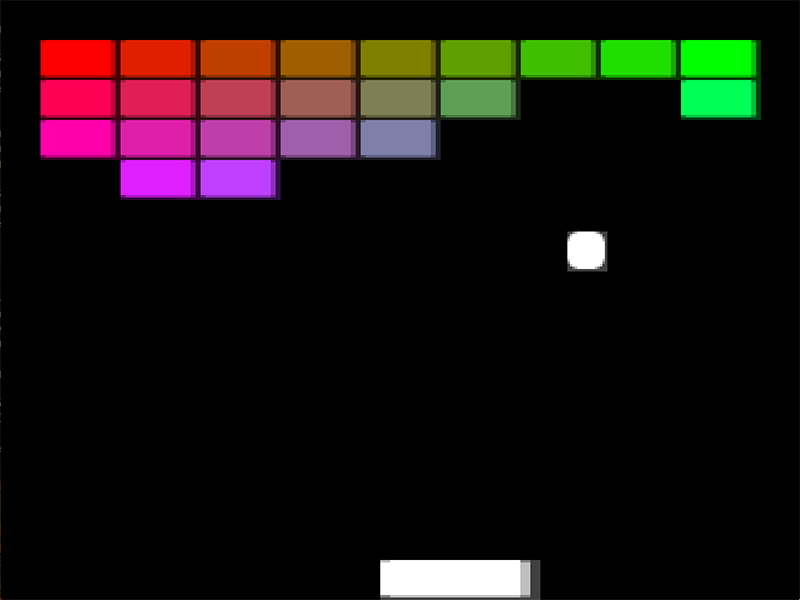
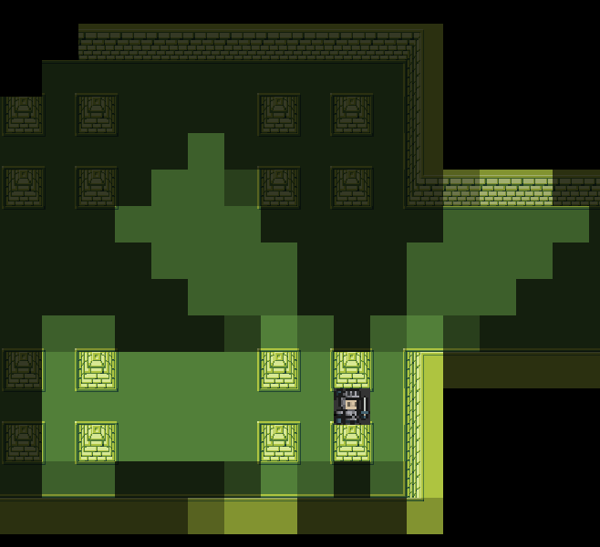
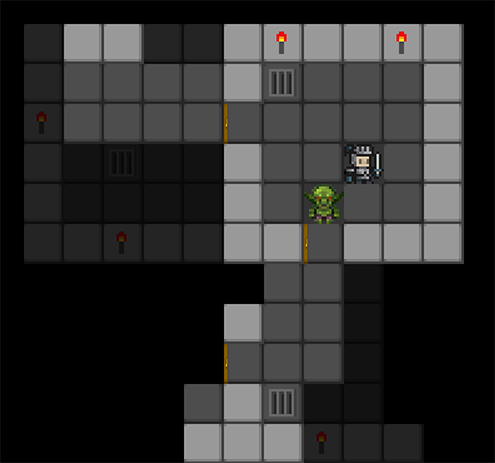
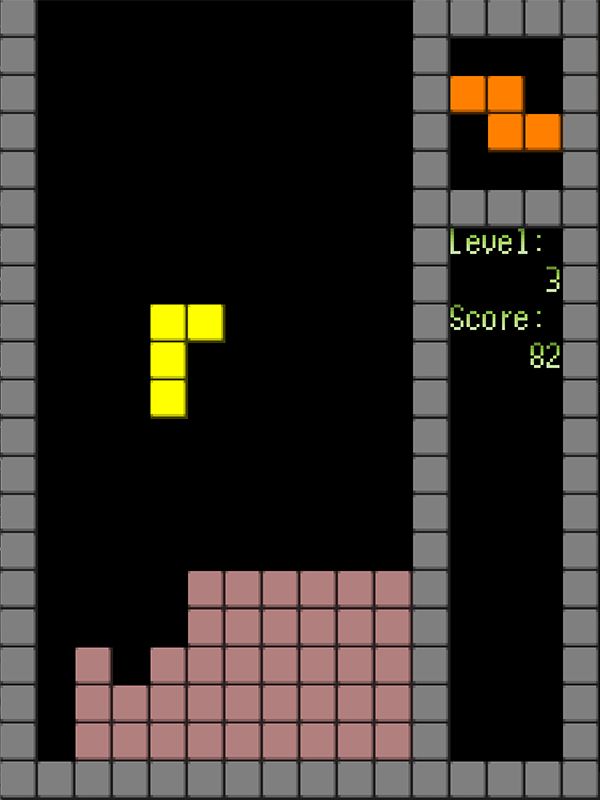
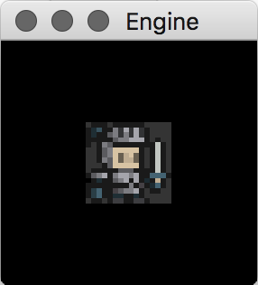

# Game Engine

This is an experimental cross-platform 2D game engine developed around Lua as both a scripting language and as a data description language.

I don't plan on continuing development of this engine as I was finding the tight coupling with the scripting language to be more restrictive than I'd like. Regardless, the scripting system turned out  rather flexible and I was able to prototype a variety of minigames with it.

Some parts may be interesting to look at on their own, like the Serializer which dumps the entire game state, including functions, closures, and metatables, to plain-text Lua script.

## Screenshots

*breakout.lua*


*dungeon.lua*


*rouge.lua*


*tetromino.lua*


## Features

- Sprite and tilemap graphics
- Tile-based pathfinding and shadow casting
- Collision detection and limited physics (continuous, linear only)
- Serialize entire game state to Lua files
- Gamepad support through SDL and GLFW
- Limited audio support through SDL

## Getting Started

CMake 3+ is used for generating the build system. Unix Makefiles and Visual Studio generators have been tested on macOS and Windows respectively.

### Prerequisites

The engine can be built with SDL and GLFW as platforms, by setting the `USE_SDL` and `USE_GLFW` CMake options. SDL is recommended and is enabled by default. If built with both, the platform may be selected at runtime with command-line flags `-sdl` and `-glfw`.

### Building

On macOS, from the root folder:
```
mkdir build
cd build
cmake ..
cmake --build .
```

On Windows, use CMake GUI to generate a Visual Studio solution.

### Running

Run the engine with the path to a Lua script as a command-line argument. For example:
```
./engine breakout.lua
```

If a file is not found at the specified path, the directories `scripts/` and `../scripts/` will be searched as well.

### Example Script

This example script creates a 3x3 unit canvas with a single sprite drawn in the center.
```
local game = Canvas {
    camera = Camera2D {
        size = { 3, 3 },
        fixed = true
    }
}
addCanvas(game)

local hero = Actor {
    graphics = SpriteGraphics { sprite = "hero.tga" },
    transform = { position = { 1, 1 } }
}
game:addActor(hero)
```


More complex example scripts are included in the `scripts/` folder:

- **bomb.lua** Bomberman clone
- **breakout.lua** Breakout clone
- **dungeon.lua** timemap beautifier
- **painter.lua** tilemap painter
- **pftest.lua** pathfinding test
- **physics.lua** physics test benches
- **platform.lua** platformer test
- **rouge.lua** Roguelike test
- **runner.lua** endless running test
- **snake.lua** multi-player Snake clone
- **test.lua** self-reproducing serialization test
- **tetromino.lua** a Tetris clone

## Scripting System

TODO

## Engine Architecture

TODO
