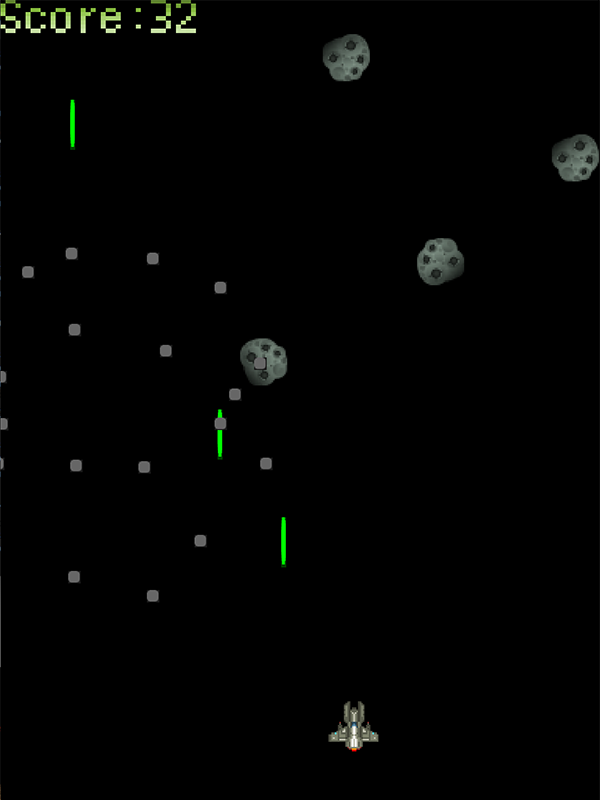

# Game Engine

This is an experimental cross-platform 2D game engine developed around Lua as both a scripting language and as a data description language.

I don't plan on continuing development of this engine as I was finding the tight coupling with the scripting language to be more restrictive than I'd like. Regardless, the scripting system turned out  rather flexible and I was able to prototype a variety of minigames with it.

Some parts may be interesting to look at on their own, like the Serializer which dumps the entire game state, including functions, closures, and metatables, to plain-text Lua script.

## Screenshots

*asteroid.lua*  


*breakout.lua*  


*dungeon.lua*  


*rouge.lua*  


*tetromino.lua*  


## Features

- Sprite and tilemap graphics
- Tile-based pathfinding and shadow casting
- Collision detection and limited physics (continuous, linear only)
- Serialize entire game state to Lua files
- Gamepad support through SDL and GLFW
- Limited audio support through SDL

## Getting Started

CMake 3+ is used for generating the build system. Unix Makefiles and Visual Studio generators have been tested on macOS and Windows respectively.

### Prerequisites

The engine can be built with SDL and GLFW as platforms, by setting the `USE_SDL` and `USE_GLFW` CMake options. SDL is recommended and is enabled by default. If built with both, the platform may be selected at runtime with command-line flags `-sdl` and `-glfw`.

### Building

On macOS, from the root folder:
```
mkdir build
cd build
cmake ..
cmake --build .
```

On Windows, use CMake GUI to generate a Visual Studio solution.

### Running

Run the engine with the path to a Lua script as a command-line argument. For example:
```
./engine asteroid.lua
```

If a file is not found at the specified path, the directories `scripts/` and `../scripts/` will be searched as well.

### Example Script

This example script creates a 3x3 unit **Canvas** with a single sprite (on an **Actor** object) drawn in the center.
```
local game = Canvas {
    camera = Camera2D {
        size = { 3, 3 },
        fixed = true
    }
}
addCanvas(game)

local hero = Actor {
    graphics = SpriteGraphics { sprite = "hero.tga" },
    transform = { position = { 1, 1 } }
}
game:addActor(hero)
```


More complex example scripts are included in the `scripts/` folder:

- *asteroid.lua* - space shooter game
- *bomb.lua* - Bomberman clone
- *breakout.lua* - Breakout clone
- *dungeon.lua* - timemap beautifier
- *painter.lua* - tilemap painter
- *pftest.lua* - pathfinding test
- *physics.lua* - physics test benches
- *platform.lua* - platformer test
- *rouge.lua* - Roguelike test
- *runner.lua* - endless running test
- *snake.lua* - multi-player Snake clone
- *test.lua* - self-reproducing serialization test
- *tetromino.lua* - a Tetris clone

## Scripting System

This section documents the features of the scripting system.

### Scene

The scene encompases the global table, list of **Canvas**es, and other bits of game state. The scene object is not directly exposed to scripting, but a number of global functions are defined to interact with it.

The following libraries are available: `base`, `table`, `io`, `os`, `string`, `math`, `utf8`. Added global math constants `inf` and `nan`. The following global functions are defined:

- `addCanvas(canvas)` - add `canvas` to the scene (stacked on top of the previous)
- `loadClosure(data)` - load the Lua function encoded in _string_ `data` 
- `saveState()` - save the current scene as Lua script, currently written to `stdout` for development
- `playSample(filename)` - play the audio clip located at _string_ `filename`
- `registerControl(control, function)` - register `function` to control named by _string_ `control`
- `setPortraitHint(boolean)` - hint to the platform to use a portrait (`true`) or landscape (`false`) mode
- `quit()` - exit the application

### Classes

Classes are instantiated by their `_ClassName_(table)` method. The shorthand `_ClassName_{key1=val1, key2=val2}` can be used as well. Keys in the `table` map to settings on the created object. New instances may also be created by cloning existing objects by calling `_ClassName_(instance)` where `instance` is an instance of that class.

All instances have individual properties that can be set with the **.** and **[]** operators. For example: `object.foo = 'bar'` and `print(object['baz'])`. Additionally, methods set on the object can be called with the `:` operator, like `object:qux()`. Built-in properties like `_Canvas_.addActor` are read-only, but unused properties can be freely set by the user.

All class constructors take the key `members`, which is a table containing properties to be set on the object.

### Canvas

**Canvas** is a game object that acts like a layer in a scene.

A **Canvas** is created by the `Canvas(table)` method. The following keys may be set in `table`:

- `camera` - a **Camera** to affect the layout of the **Canvas**
- `paused` - a _boolean_ indicating if the **Canvas** is paused
- `visible` - a _boolean_ indicating if the children of the **Canvas** will be rendered

The following methods are defined on **Canvas**:

- `addActor(actor)` - add `actor` to the **Canvas**
- `removeActor(actor)` - remove `actor` from the **Canvas** 
- `clear()` - remove all **Actor**s from the **Canvas**
- `setCenter(actor / x, y)` - centers the camera on either `actor` or coordinates <`x`, `y`> 
- `setOrigin(x, y)` - places the upper left of the camera at coordinates <`x`, `y`>
- `getCollision(x, y)` - return the first **Actor** to collide with coordinates <`x`, `y`>
- `setPaused(boolean)` - same as the `paused` property above
- `setVisible(boolean)` - same as the `visible` property above

The following methods may be overloaded on an instance of **Canvas**:

- `onUpdatePre(delta)` - called before **Actor**s update, with `delta` seconds elapsed since last frame
- `onUpdatePost(delta)` - called after **Actor**s update, with `delta` seconds elapsed since last frame
- `onClickPre(down)` - called before propagating mouse clicks, with _boolean_ `down` indicating press/release
- `onClickPost(down)` - called after propagating mouse clicks, with _boolean_ `down` indicating press/release

### Camera2D

**Camera2D** is an implementation of **Camera** that can be set on **Canvas**.

A **Camera2D** is created by the `Camera2D(table)` method. The following keys may be set in `table`:

- `size` - a _table_ {w, h} to set the number of game units along each axis
- `center` - a _table_ {x, y} to set the center coordinate of the window
- `fixed` - a _boolean_ `true` if both axes are locked, `false` if vertical axis follows aspect ratio

There are no methods defined on **Camera2D**, but **Canvas** has methods to adjust the camera position.

### Actor

**Actor** is a game object that represents an entity shown on a **Canvas**. The **Actor** can be decorated with components that affect the appearance and behavior of the object.

An **Actor** is created by the `Actor(table)` method. The following keys may be set in `table`:

- `graphics` - a **Graphics** component to affect appearance
- `collider` - a **Collider** component to affect collision detection
- `pathing` - a **Pathing** component to affect path finding
- `physics` - a _table_ of physics properties
    - `mass` - a _number_ with the mass of the object
    - `cor` - a _number_ with the coefficient of restitution (1 for perfectly elastic)
    - `velocity` - a _table_ {x, y} with the initial linear velocity
    - `acceleration` - a _table_ {x, y} with the initial linear acceleration
- `transform` - a _table_ of transform properties
    - `position` - a _table_ {x, y} with the initial position 
    - `scale` - a _table_ {x, y} with the initial scale
- `layer` - a _number_ where higher layers are rendered last (on top) of other object

The following methods are defined on an instance of **Actor**:

- `getCanvas()` - gets the **Canvas** to which this belongs, or `nil`
- `getGraphics()` - gets the **Graphics** component, or nil 
- `setGraphics(graphics)` - sets the **Graphics** component to `graphics`
- `getCollider()` - gets the **Collider** component, or nil
- `setCollider(collider)` - sets the **Collider** component to `collider`
- `getPathing()` - gets the **Pathing** component, or nil
- `setPathing(pathing)` - sets the **Pathing** component to `pathing`
- `getPosition()` - returns position as `x`, `y`
- `setPosition(x, y)` - sets the position to `x`, `y`
- `setScale(x, y)` - sets the scale to `x`, `y`
- `testCollision(dx, dy)` - returns an **Actor** which would collide if this instance were moved by `dx`, `dy`
- `setVelocity(x, y)` - sets the velocity to `x`, `y`
- `getVelocity()` - returns velocity as `x`, `y`
- `addAcceleration(x, y)` - adds `x`, `y` to the acceleration

The following methods may be overloaded on an instance of **Actor**:

- `onUpdate(delta)` - called before **Actor**s update, with `delta` seconds elapsed since last frame
- `onClick(down, x, y)` - called when receiving mouse clicks, with _boolean_ `down` and position `x`, `y`
- `onCollide(actor)` - called on collision with **Actor** `actor`

### Input

Keyboard controls can be mapped to functions by calling `registerControl()`. The currently defined control names are `'up'`, `'left'`, `'down'`, `'right'`, `'w'`, `'a'`, `'s'`, `'d'`, `'action'`, and `'quit'`. The cardinal directions and `'action'` (`A` button) can be triggered by gamepads as well.

Mouse clicks can be received on **Actor**s by overloading the `onClick()` method. **Canvas**es can also receive mouse clicks by overriding `onClickPre()` and `onClickPost()` (which fire before and after mouse clicks are handled by children). If any of these callbacks return `true`, the event will be captured and not propagated further.

## Engine Architecture

TODO

## Authors

Trevor Smith - [LinkedIn](https://linkedin.com/in/trevorsm/)
